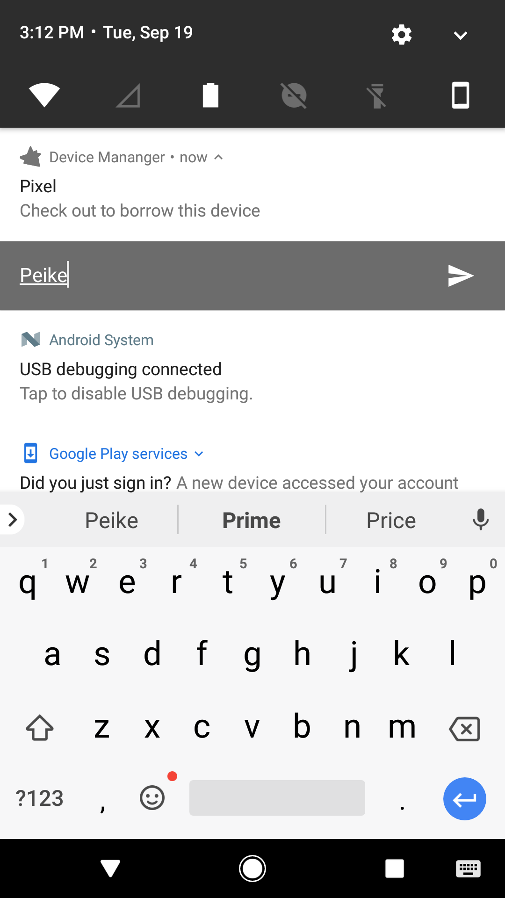
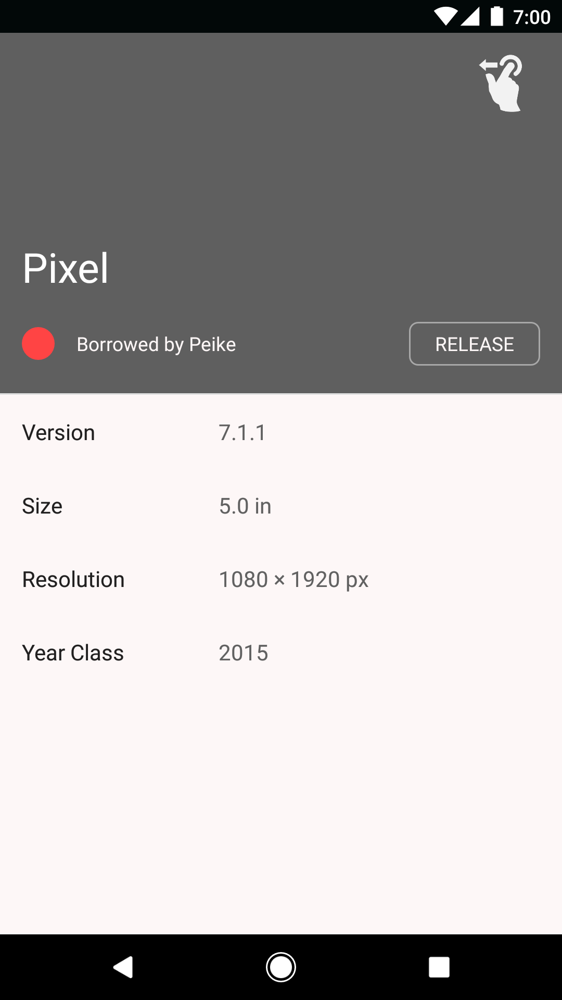
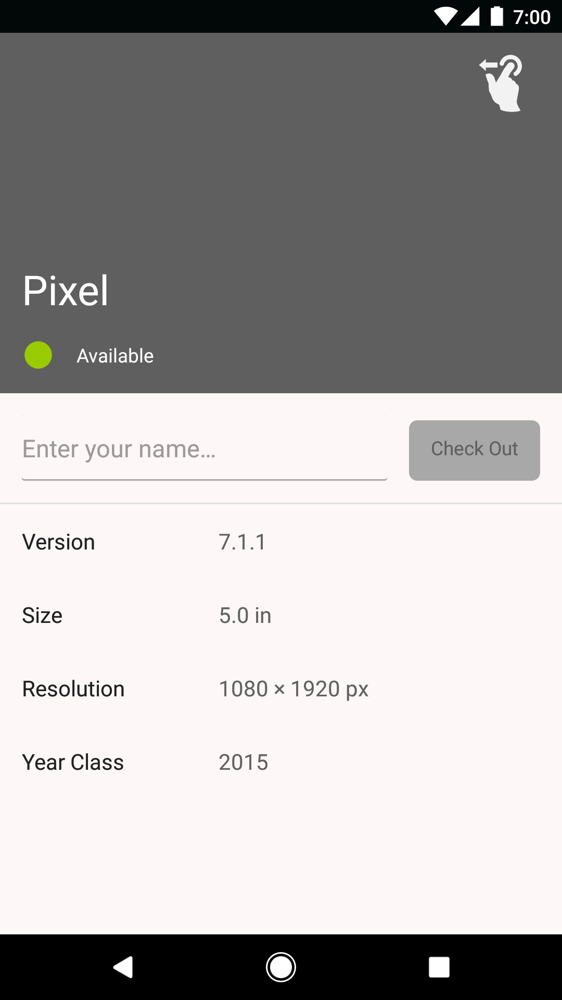

device-manager
---
An app to view and manage testing devices at Detroit Labs. 

#### Features
* View the list of all devices and their status
* Search devices by platform, version, screen size, resolution and etc.
* Check out device to borrow one
* Check in device to return one
* Send request to the checked out device 

#### Screen shots

